# AI Boot Camp Azure ML Studio HOL
#### 2018.12.15. Speaker: [전미정](https://github.com/MijeongJeon)🐈, Assistant: [김정환](https://github.com/iz4blue)🐵

---

#### [1부. Azure AI 둘러보기, Azure Pass 등록](#1부)
#### [2부. Data 준비, 전처리](#2부)
#### [3부. 모델 훈련, 평가, 배포](#3부)

### 1부. Azure AI 둘러보기, Azure Pass 등록

#### 1-1. 마이크로소트트 계정 생성하기 (live.com)
> [주의] 이미 live.com 계정이 있는 경우 바로 로그인하시면 됩니다. 하지만 하나의 계정당 하나의 Azure Pass만 사용할 수 있으므로 이전에 Azure Pass를 사용한 적이 있는 계정이라면 새로 계정을 생성해주세요!

[https://signup.live.com/](https://signup.live.com)에 접속해 로그인하거나 계정을 생성합니다.

천천히 따라하는 계정 생성하기 펼쳐 보기(클릭)

1. [https://signup.live.com/](https://signup.live.com)에 접속해 로그인하거나 계정을 생성합니다.
(아래 단계는 새롭게 생성하는 계정하는 방법입니다. 로그인하신 분은 2단계로 넘어가주세요.)

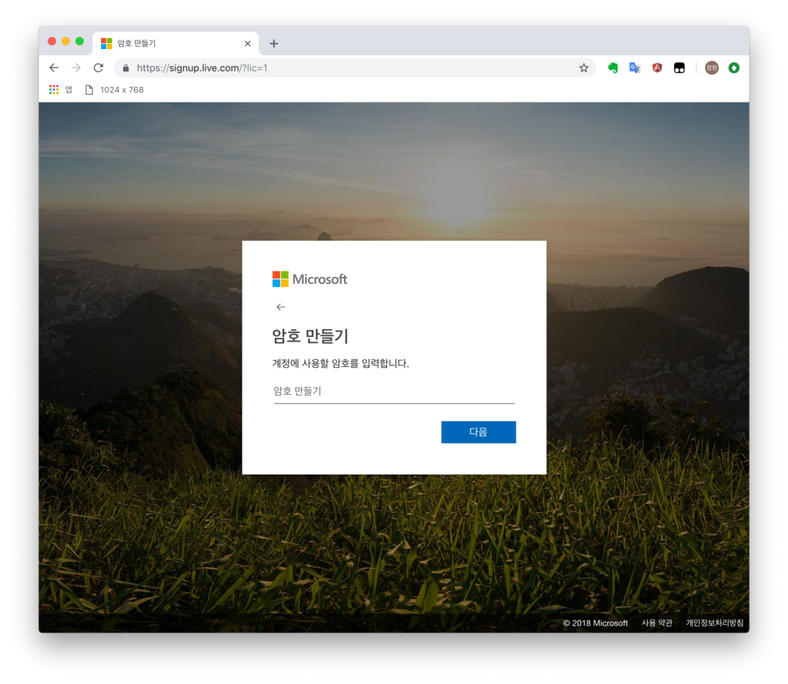

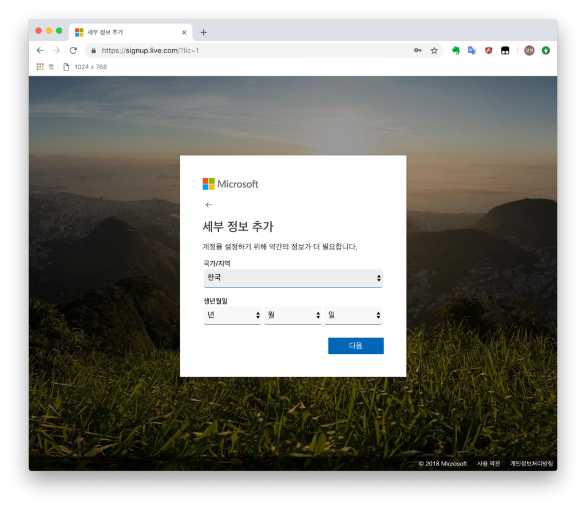

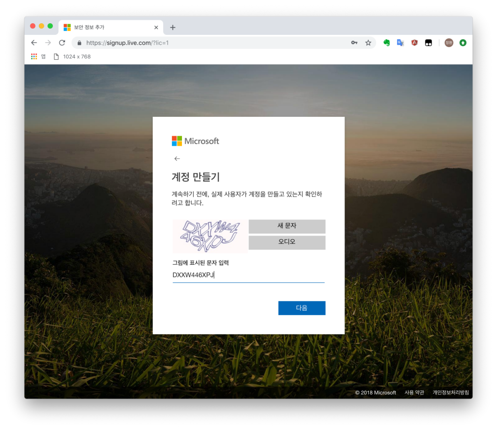
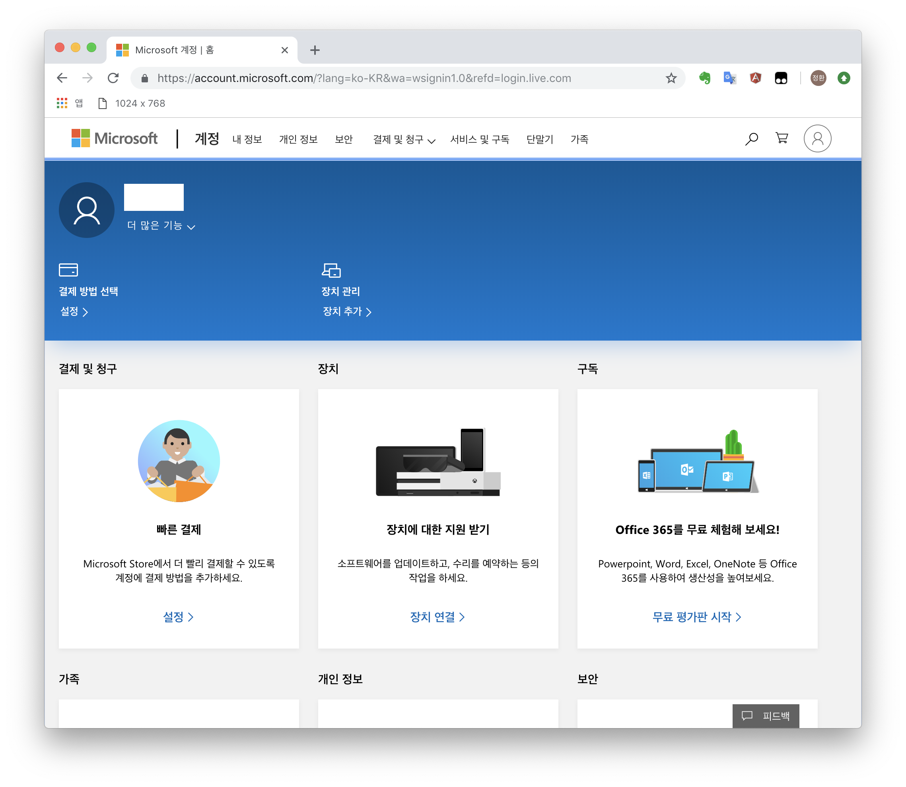

계정 만들기 완료! 

#### 1-2. Azure Pass 등록(어렵진 않지만 그렇다고 쉽지도 않은 Pass 등록! 친절한 스크린샷을 따라 천천히 등록해보아요)
> [주의] 하나의 계정당 하나의 Azure Pass만 사용할 수 있습니다. 만일 이전에 Azure Pass를 사용한 적이 있는 계정이라면 새로 계정을 생성해주세요!

[https://www.microsoftazurepass.com/](https://www.microsoftazurepass.com)에 접속해 Azure Pass를 등록합니다.

천천히 따라하는 Azure Pass 등록과정 펼쳐 보기(클릭)

2. [https://www.microsoftazurepass.com/](https://www.microsoftazurepass.com)

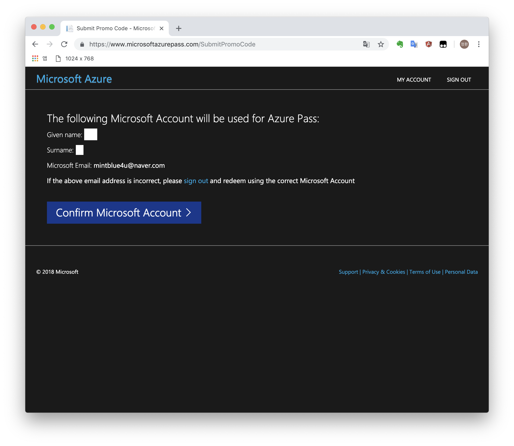
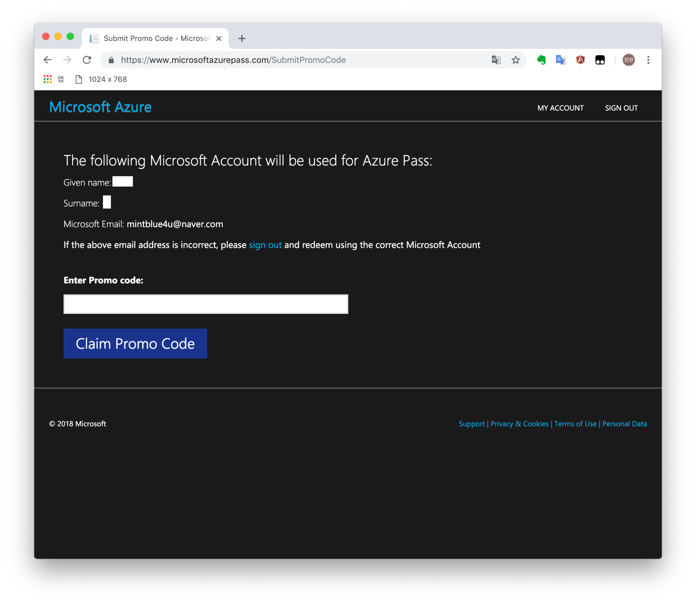
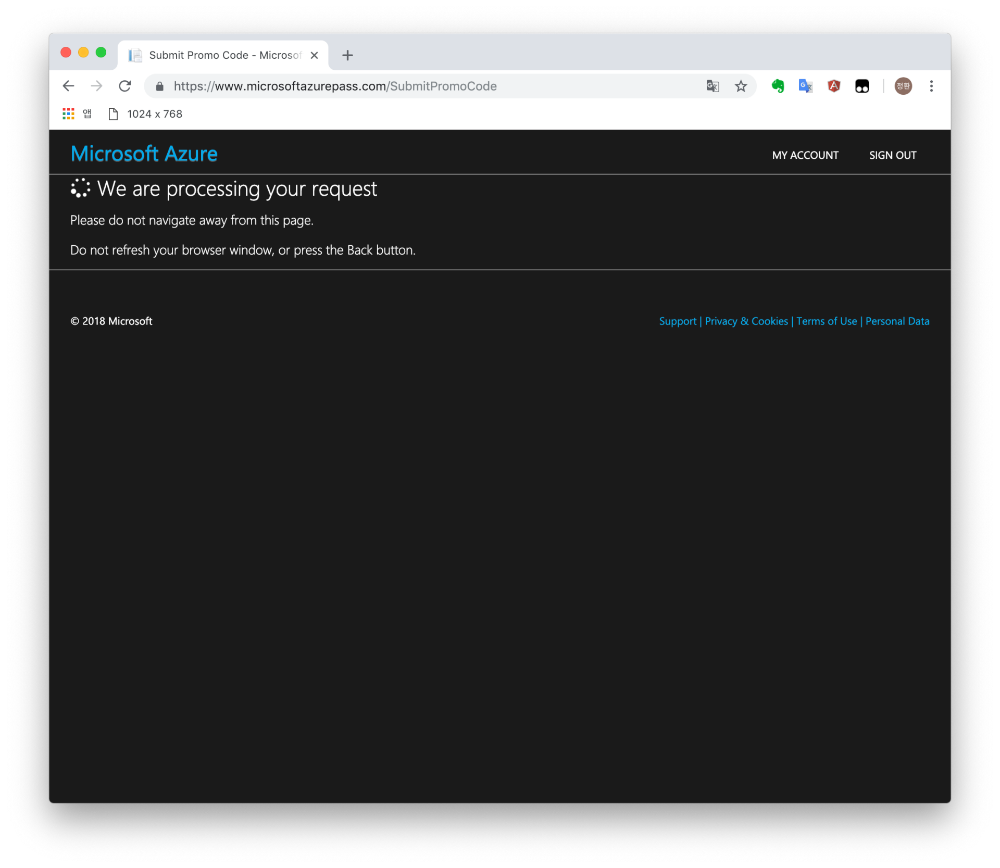
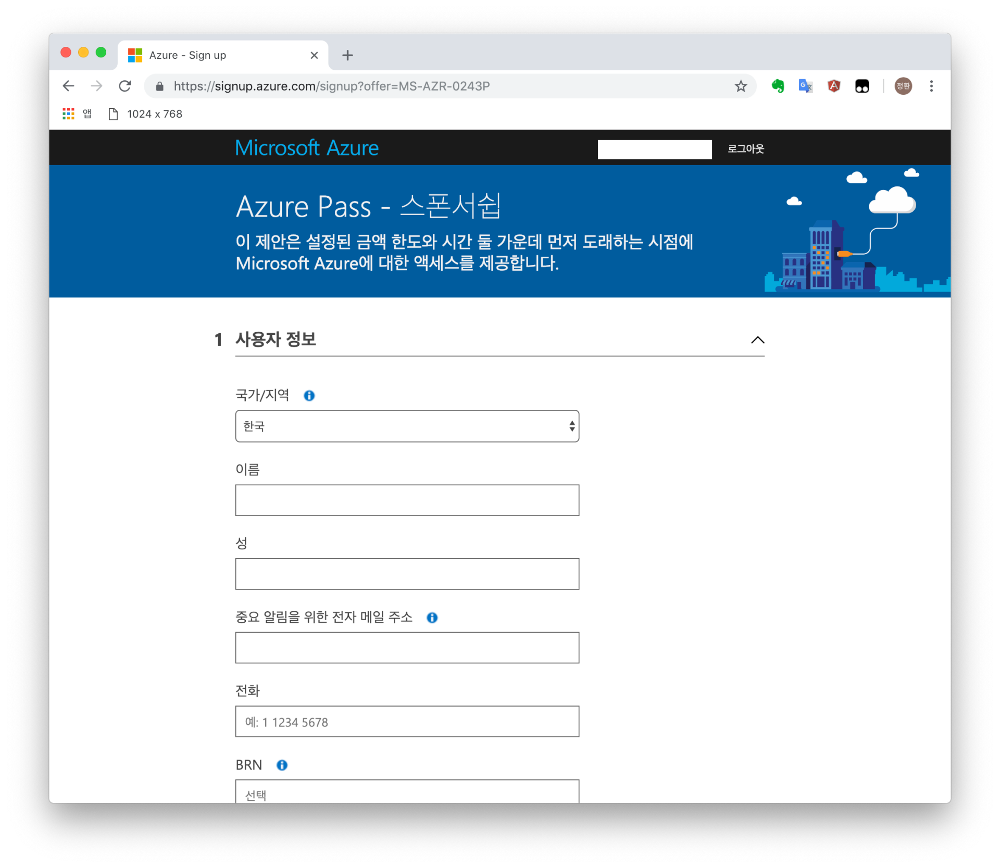
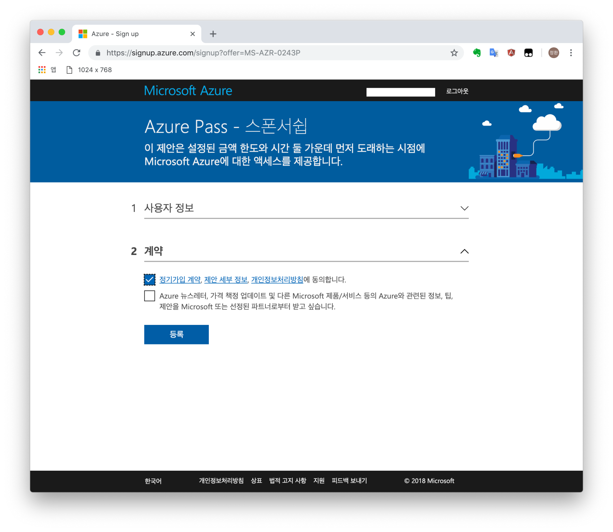
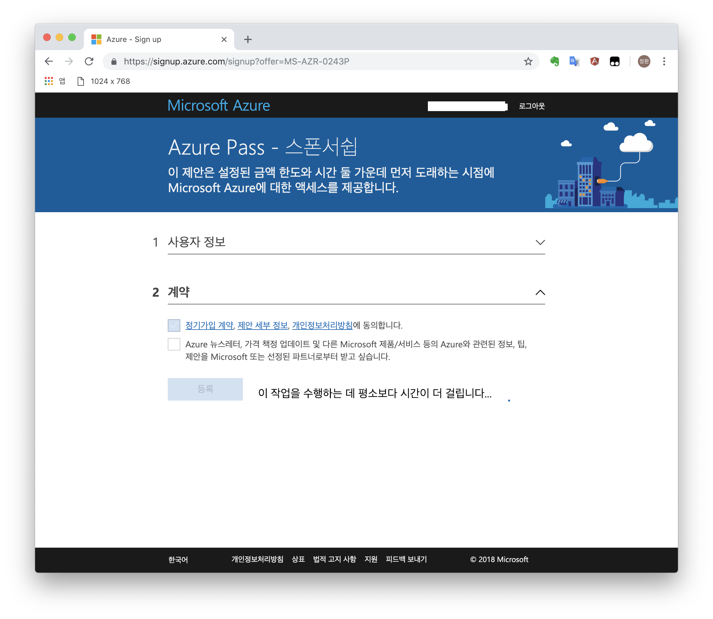
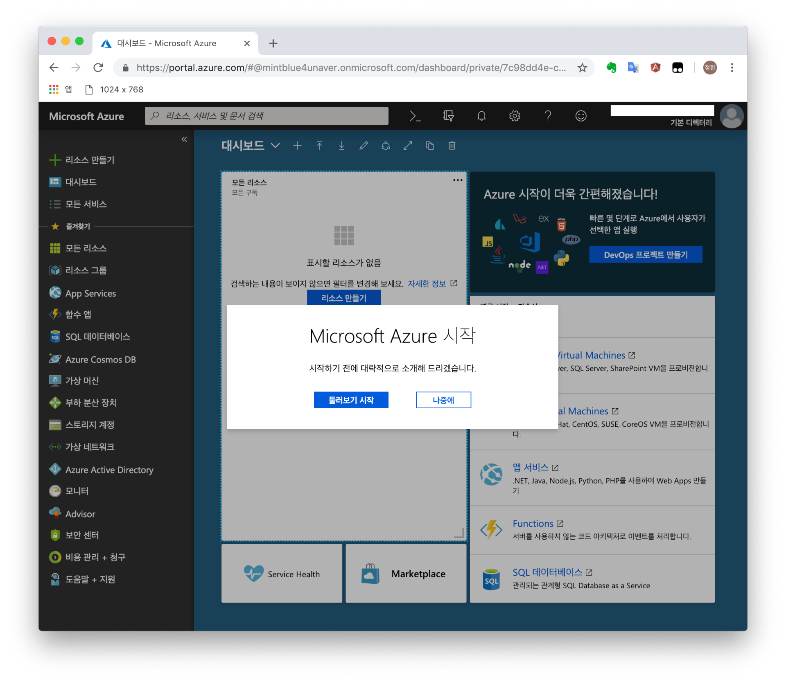

Azure Pass 등록 완료! 

#### 1-3. [Azure ML Studio 로그인](https://studio.azureml.net)
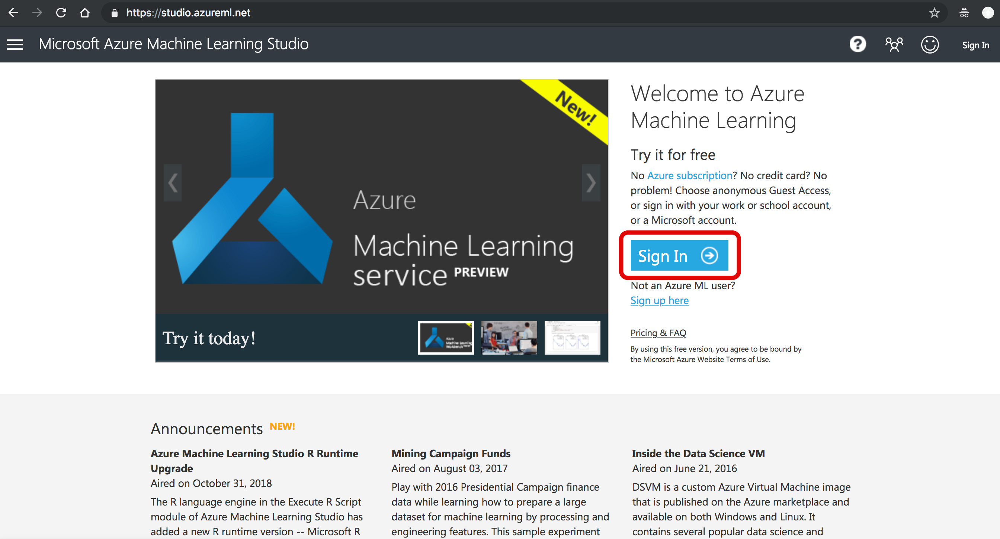 
 
##### 준비완료 화면 🤗
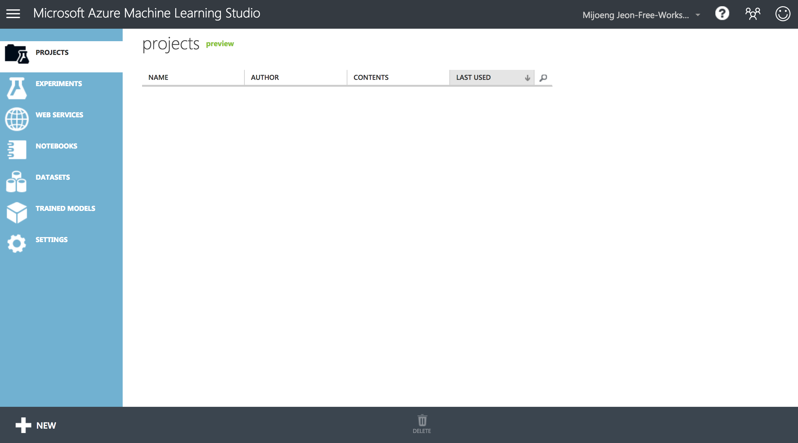 

### 2부. Data 준비, 전처리
##### [Data 내려받기](http://bit.ly/181215_hol_dataset)

### 3부. 모델 훈련, 평가, 배포
##### [Azure 머신러닝 모델 고르기](https://docs.microsoft.com/ko-kr/azure/machine-learning/studio/algorithm-choice)  
##### [Azure regression 모델 설명](https://docs.microsoft.com/en-us/azure/machine-learning/studio-module-reference/machine-learning-initialize-model-regression)  

---

### 관련 사이트 링크

[캐글 데이터셋](https://www.kaggle.com/datasets)  
[UCI 데이터셋](http://archive.ics.uci.edu/ml/datasets.html)  
[Azure 갤러리](https://gallery.azure.ai)  
[Azure ML Studio에서 R 사용하기 실습](https://docs.microsoft.com/ko-kr/azure/machine-learning/studio/r-quickstart)  
[Azure Cognitive Sevice](https://azure.microsoft.com/ko-kr/services/cognitive-services/)  
[Azure Custom Vision](https://azure.microsoft.com/ko-kr/services/cognitive-services/custom-vision-service/)
