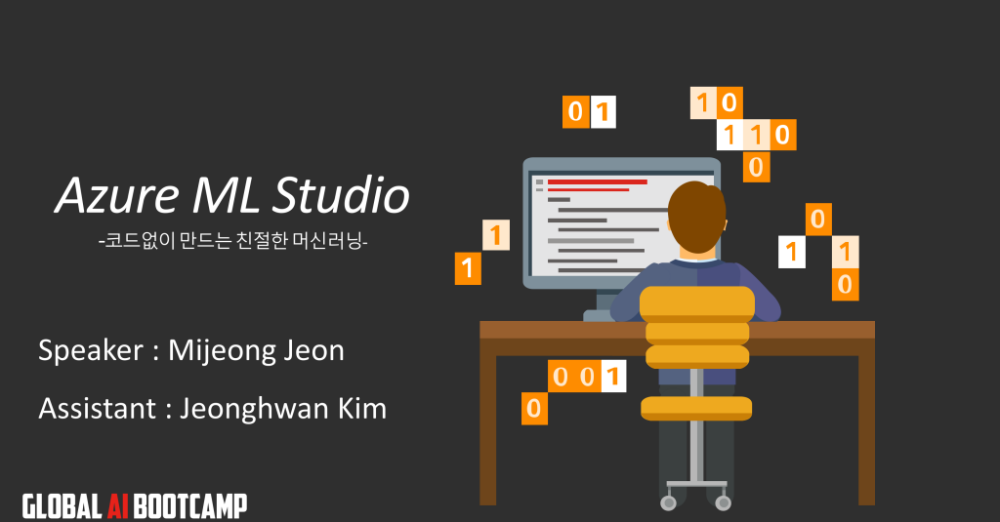

# AI Boot Camp Azure ML Studio HOL
#### 2018.12.15. Speaker: [전미정](https://github.com/MijeongJeon)🐈, Assistant: [김정환](https://github.com/iz4blue)🐵

 
 
 
 

---

#### [1부. Azure AI 둘러보기, Azure Pass 등록](#1부)
#### [2부. Data 준비, 전처리](#2부)
#### [3부. 모델 훈련, 평가, 배포](#3부)

### 1부. Azure AI 둘러보기, Azure Pass 등록
#### 1-1. 마이크로소트트 계정 생성하기 (live.com)
> [주의] 이미 live.com 계정이 있는 분은 [https://signup.live.com/](https://signup.live.com/)에 바로 로그인하시면 됩니다. 하지만 하나의 계정당 하나의 Azure Pass만 사용할 수 있으므로 이전에 Azure Pass를 사용한 적이 있는 계정이라면 새로 계정을 생성해주세요!

◀️◀️ 친절한 계정 생성 과정 펼쳐 보기(클릭) ▶️▶️
 

1. [https://signup.live.com/](https://signup.live.com)에 접속해 계정으로 사용할 메일을 입력합니다.

2. 사용할 암호를 입력합니다.

3. 이름과 성을 입력합니다.

4. 약간의 정보를 더 입력합니다.

5. (중요) 입력한 메일 주소로 받은 코드를 입력합니다.

6. (어려움) 눈을 크게 뜨고 정신을 모아 캡차를 입력합니다.

7. (축하) 계정 만들기 성공하셨습니다.

#### 1-2. Azure Pass 등록(어렵진 않지만 쉽지도 않은 Pass 등록! 친절한 스크린샷을 따라 천천히 등록해보아요)

[https://www.microsoftazurepass.com/](https://www.microsoftazurepass.com)에 접속해 Azure Pass를 등록하는 과정입니다.

◀️◀️ 친절한 Azure Pass 등록 과정 펼쳐 보기(클릭) ▶️▶️

1. [https://www.microsoftazurepass.com/](https://www.microsoftazurepass.com)에 접속해 `Start` 버튼을 누릅니다.

2. 마이크로소프트 계정을 확인한뒤 `Confirm Microsoft Account`를 클릭합니다.

3. 오늘 행사에서 받은 Azure Pass를 입력하고 `Claim Promo Code`를 클릭합니다.

4. 기다립니다. 기다림은 즐거운 일이죠 :)

5. Azure Pass를 사용할 사용자 정보를 입력합니다.

6. 계약, 제안, 방침에 동의합니다. 뉴스레터는 귀찮으니까 체크하지 마세요. 😉

7. 기다립니다. 역시 기다림은 즐겁죠 :)

8. 등록에 성공하셨습니다! 👍

Azure Pass 등록 완료! 

#### 1-3. Azure ML Studio 로그인
대망의 [Azure ML Studio](https://studio.azureml.net)에 로그인해봅시다. 

◀️◀️ 친절한 Azure ML Studio 로그인 과정 펼쳐 보기(클릭) ▶️▶️

1. [Azure ML Studio](https://studio.azureml.net)에 접속해 로그인 버튼을 누릅니다.
 
 
2. 준비완료 🤗
 

### 2부. Data 준비, 전처리
##### [Data 내려받기](http://bit.ly/181215_hol_dataset)

### 3부. 모델 훈련, 평가, 배포
##### [Azure 머신러닝 모델 고르기](https://docs.microsoft.com/ko-kr/azure/machine-learning/studio/algorithm-choice)  
##### [Azure regression 모델 설명](https://docs.microsoft.com/en-us/azure/machine-learning/studio-module-reference/machine-learning-initialize-model-regression)  

---

### 관련 사이트 링크

[캐글 데이터셋](https://www.kaggle.com/datasets)  
[UCI 데이터셋](http://archive.ics.uci.edu/ml/datasets.html)  
[Azure 갤러리](https://gallery.azure.ai)  
[Azure ML Studio에서 R 사용하기 실습](https://docs.microsoft.com/ko-kr/azure/machine-learning/studio/r-quickstart)  
[Azure Cognitive Sevice](https://azure.microsoft.com/ko-kr/services/cognitive-services/)  
[Azure Custom Vision](https://azure.microsoft.com/ko-kr/services/cognitive-services/custom-vision-service/)

--- 

#### [📝 발표자료 보기](/181215_AIBootCamp_HOL.pdf)
